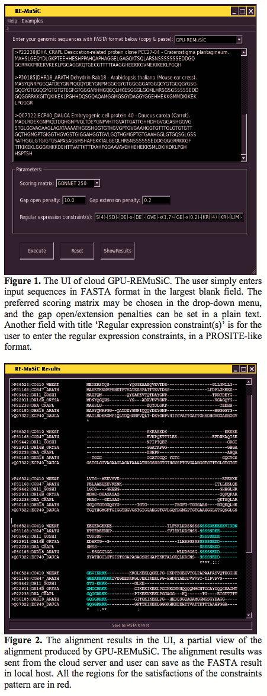

Multiple sequence alignments with constrains has become an important problem in the computational biology. The concept of constrained sequence alignment is proposed to incorporate the biologist’s domain knowledge into sequence alignments such that the user-specified residues/segments are aligned together in the alignment results. Over the past decade, a series of constrained multiple sequence alignment tools were proposed in the literature. GPU-REMuSiC is a newest tool with the regular expression constrains and uses the graphics processing units (GPUs) with CUDA. GPU-REMuSiC can achieve 29× speedups for overall computation time by the experimental results.

		
		