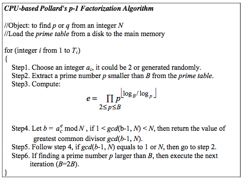
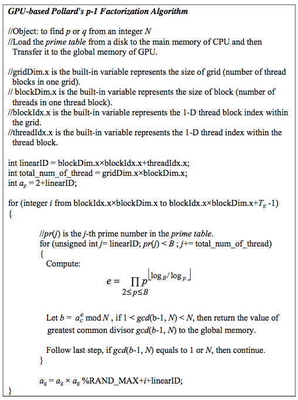

Cryptography is an important technique among various applications. In the telecommunication, cryptography is necessary when an untrusted medium is communicated in the network. RSA is a public-key cryptography algorithm to use a pair (N, E) as the public key and D as the private key. The N is the product of two large prime numbers p and q that are kept secret. It is very hard and no known polynomial time algorithms can be used to extract p and q from a large number N. There are many methods of factoring large numbers have been proposed. The advantages of computing power and memory bandwidth for modern GPUs have made porting applications on it become a very important issue. In this work, we proposed an efficient parallel RSA decryption algorithm for many-core GPUs with CUDA. The experimental results showed that the proposed GPU-based algorithm can achieve 1197.5x average speedup compared with the CPU-based algorithm, and within a reasonable time to find out the result of factoring large numbers.

## Preliminary Concepts

		

[PDF link](../documents/CrackRSA.pdf)
		